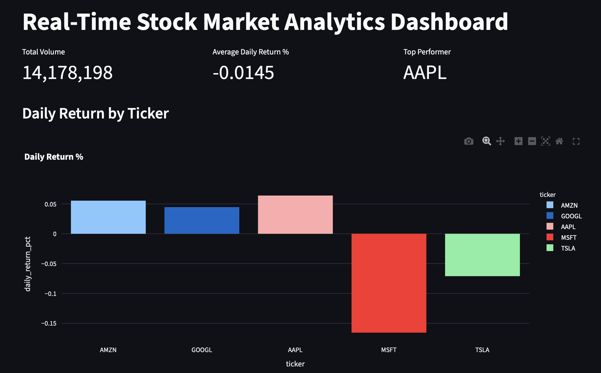
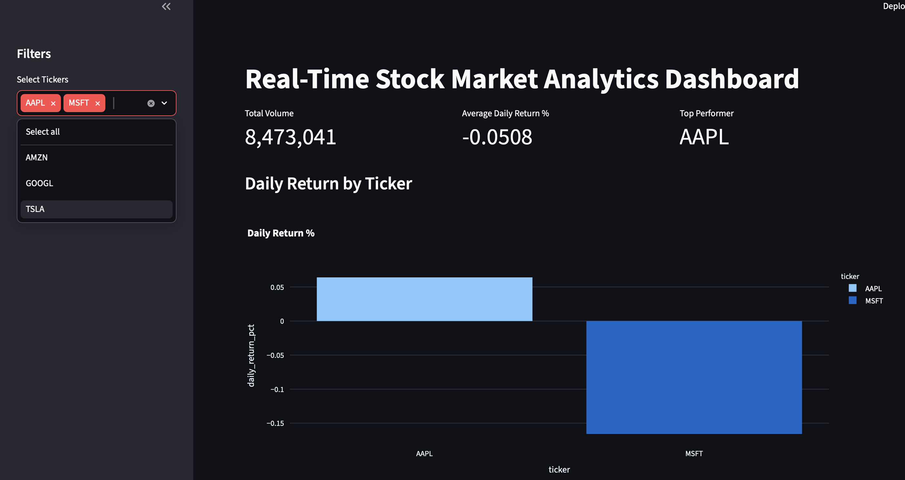
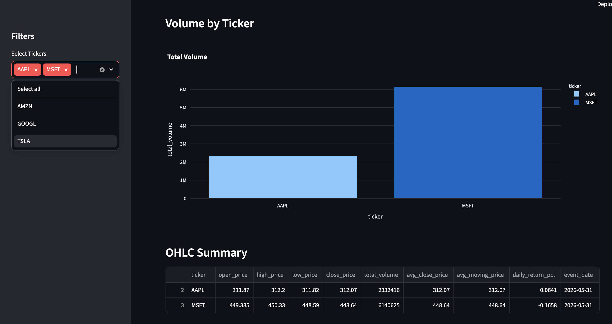

# Real-Time Stock Market Data Pipeline

## Overview

A real-time data engineering project that ingests live stock market data from Yahoo Finance, streams events through Apache Kafka, processes data using Spark Structured Streaming, stores data in a multi-layered lakehouse architecture (Bronze, Silver, Gold), and visualizes analytics through Streamlit.

## Dashboard Preview

### Dashboard Overview



### Interactive Filtering




---

## Architecture

See:

docs/architecture.md

---

## Tech Stack

- Python
- Apache Kafka
- Apache Spark Structured Streaming
- Parquet
- Streamlit
- Plotly
- Git
- Docker

---

## Data Flow

Yahoo Finance API
→ Kafka Producer
→ Kafka Topic
→ Spark Structured Streaming
→ Bronze Layer
→ Silver Layer
→ Gold Layer
→ Streamlit Dashboard

---

## Project Structure

```text
real-time-stock-market-pipeline/

├── data
│   ├── bronze
│   ├── silver
│   └── gold
│
├── src
│   ├── producer
│   ├── streaming
│   ├── batch
│   └── dashboard
│
├── sql
├── docs
├── requirements.txt
└── README.md
```

## Bronze Layer

Stores raw streaming stock events.

Columns:

- ticker
- event_time
- open
- high
- low
- close
- volume

Partitioned by:

- event_date
- ticker

## Silver Layer

Derived metrics:

- Price Change %
- Moving Average
- Alert Flags
- Historical Comparison

## Gold Layer

Business-ready analytics:

- Daily Open
- Daily High
- Daily Low
- Daily Close
- Total Volume
- Daily Return %

## SQL Analytics

Included analyses:

- Daily Performance
- Top Gainers
- Highest Volume Stocks
- Volatility Analysis
- Average Closing Price

## Dashboard

Features:

- KPI Cards
- Daily Return Analysis
- Volume Analysis
- Stock Performance Comparison
- Interactive Filters

## How To Run

### Start Kafka

```bash
docker compose up -d
```

### Start Producer

```bash
python src/producer/stock_producer.py
```

### Start Streaming

```bash
python src/streaming/spark_streaming.py
```

### Build Silver Layer

```bash
python src/batch/build_silver_metrics.py
```

### Build Gold Layer

```bash
python src/batch/build_gold_summary.py
```

### Launch Dashboard

```bash
streamlit run src/dashboard/app.py
```

## Resume Highlights

- Designed a real-time streaming data pipeline using Kafka and Spark Structured Streaming.
- Implemented Bronze, Silver, and Gold lakehouse architecture using Parquet.
- Built automated stock market analytics and KPI calculations.
- Developed an interactive Streamlit dashboard for financial insights.
- Orchestrated streaming and batch processing workloads using Python and Docker.
